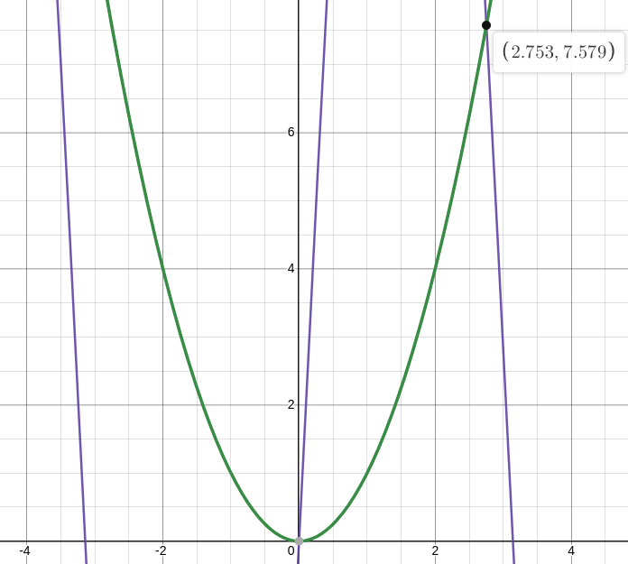
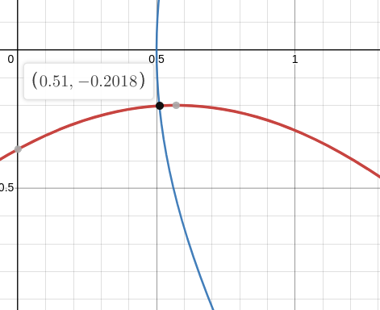

# Лабораторная работа номер 3

## Задание 1
Отделить корни уравнения $f(x) = x^2 - 20sin(x) = 0$, а затем уточнить один из них с помощью подходящего итерационного процесса.

Первый очевидный корень $x = 0$. Локализуем второй корень: 
$f(\frac{\pi}{2}) < 0,~ f(\pi) > 0 \Rightarrow$
корень находится на отрезке $[\frac{\pi}{2}; \pi] - $это и примем за отрезок локализации.

Теперь выберем итерационный процесс. Рассмотрим $x_{k+1} = \sqrt{20sin(x_k)}$.
$$\varphi'(x) = (\sqrt{20sin(x)})' = \frac{5cos(x)}{\sqrt{5sin(x)}}$$

$\varphi'(x) > 1~$ на отрезке $(\frac{\pi}{2}; \pi] \Rightarrow$ ищем другой итерационный процесс.

Рассмотрим $x_{k+1} = \pi - \arcsin{\frac{x_{k}^2}{20}}$.
$$\left|\varphi'(x)\right| = \left|-\frac{2x}{\sqrt{400 - x^4}}\right| < 1$$
То есть $\varphi'(x) < 1$ на отрезке локализации, значит этот итерационный процесс можно использвать. С помощью этого итерационного процесса корень получился $x \approx 2.7529$. Проверяя с помощью desmos, убедился, что такой корень и должен был получится. Метод сошелся с точностью $\varepsilon = 10^{-16}$ за 29 итераций.

## Задание 2
Вычислить с точностью $\varepsilon = 10^{-3}$ координаты точек пересечения нелинейного уравнения методом Ньютона.

$$\begin{equation*} 
    \begin{cases}
        sin(x+1) - y = 1.2\\
        2x + cos(y) = 2
    \end{cases}
\end{equation*}$$

Выберем область локализации:

$$G = \begin{equation*} 
    \begin{cases}
        0.3  \leq x \leq 0.7\\
        -0.5 \leq y \leq 0
    \end{cases}
\end{equation*}$$

Метод Нютона: $x_{k + 1} = x_k - J^{-1}F(x_k)$. То есть для начала нужно найти якобиан исходного уравнения:

$$\begin{equation*} 
    \begin{cases}
        F_1(x) = sin(x+1) - y - 1.2\\
        F_2(x) = 2x + cos(y) - 2
    \end{cases}
\end{equation*}$$

$$\begin{equation*}
J = \left(
    \begin{array}{cccc}
        \frac{dF_1}{dx} & \frac{dF_1}{dy}\\
        \frac{dF_2}{dx} & \frac{dF_2}{dy}\\
    \end{array}
    \right) = \left(
        \begin{array}{cccc}
            cos(x + 1) & -1\\
            2          & -sin(y)\\
        \end{array}
        \right)
\end{equation*}$$

Таким образом получил результат:

$$\begin{equation*}
    \left(
    \begin{array}{cccc}
        x_0\\
        y_0\\
    \end{array}
    \right) = \left(
        \begin{array}{cccc}
            0.51015014  \\
            -0.20183841 \\
        \end{array}
        \right)
\end{equation*}$$

Сравнил результат с desmos, убедился, что получен правильный результат. Метод сошелся с точностью $\varepsilon = 10^{-3}$ за 2 итерации.

