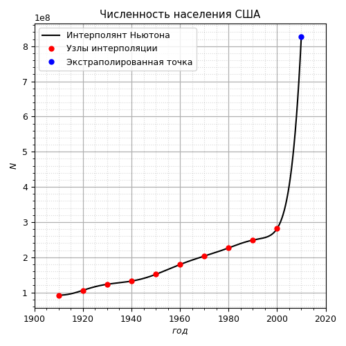

# Лабораторная работа номер 4
## VI.9.32 
Согласно переписи населения США менялось следующим образом:

|Год |Население |
| --- | --- |
|1910|92 228 496|
|1920|106 021 537|
|1930|123 202 624|
|1940|132 164 569|
|1950|151 325 798|
|1960|179 323 175|
|1970|203 211 926|
|1980|226 545 805|
|1990|248 709 873|
|2000|281 421 906|

### По приведенным данным построим интерполянт Ньютона:
Коэффициенты для интерполянта Ньютона:

Экстраполируем точку в 2010 году и построим график:

Полученное значение численности насления в 2010 году: 827906509. Истинное значение 308745538. Результат сильно отличается от истины.

### По этим же данным построим сплайн-аппроксимацию:

Используем кубический сплайн:
$$S_k(x) = a_k + b_k (x - x_k) + \frac{c_k}{2} (x - x_k)^2 +  \frac{d_k}{6} (x - x_k)^3$$ 

Наложим условия:

* $S(f_k) = f_k$
* $S_k(x_k) = S_{k + 1}(x_k)$
* $S'_k(x_k) = S'_{k + 1}(x_k)$
* $S''_k(x_k) = S''_{k + 1}(x_k)$
* $S''(1910) = S''(2000) = 0$

Из этих условий получаем систему:

$$\begin{equation*} 
    \begin{cases}
        a_k = f_k,~ k = \overline{0,n} \\
        b_k = \frac{1}{2} h_k c_k - \frac{1}{6} h^2_k d_k + \frac{f_k - f_{k - 1}}{h_k},~ k = \overline{1,n} \\
        c_0 = c_n = 0 \\
        h_kc_{k - 1} + 2(h_k + h_{k-1]})c_k + h_{k-1} c_{k+1} = 6\left(\frac{f_{k+1}}{h_{k+1}} - \frac{f_k - f_{k-1}}{h_k}\right),~ k = \overline{1,n-1}\\
        d_k = h^{-1}_k (c_k - c_{k-1}),~ k = \overline{1,n}\\
    \end{cases}
\end{equation*}$$

С помощью метода трехдиагональной прогонки находим сплайны и строим график:

Полученное значение численности насления в 2010 году: 314133939. Результат сходится с истинным значением 308745538 достаточно хорошо. 

### Вывод
Полученные результаты:

По полученным значением можно сделать вывод, что сплайн интерполяция дает более точные результаты, чем интерполяция методом Ньютона.