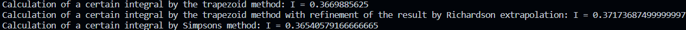

# Лабораторная работа номер 5
## VII.9.5
Для функции, заданной таблично, вычислить значение определенного интеграла методом трапеций, сделать уточнение результата экстраполяцией Ричардсона. Сравнить уточненный результат с вычислениями по методу Симпсона.

б)

|$x$    |$f(x)$  |
|  ---  |   ---  |
|0      |0       |
|0.125  |0.021470|
|0.25   |0.293050|
|0.375  |0.494105|
|0.5    |0.541341|
|0.625  |0.516855|
|0.75   |0.468617|
|0.875  |0.416531|
|1      |0.367879|

$$f(x) = \frac{e^{-1 / x}}{x^2},~~~~ \int\limits_0^1 \frac{e^{-1 / x}}{x^2}dx = 0.3678794411714423$$

## Полученные результаты

Интегрирование методом трапеций дало результат:  0.3669885625, c уточнением результата экстраполяцией Ричардсона: 0.37173687499999997, методом Симпсона: 0.36540579166666665.