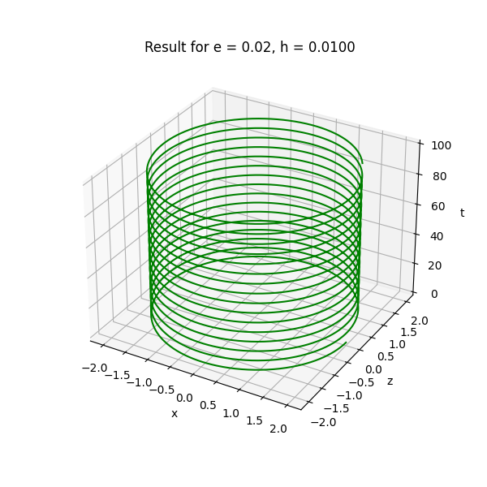
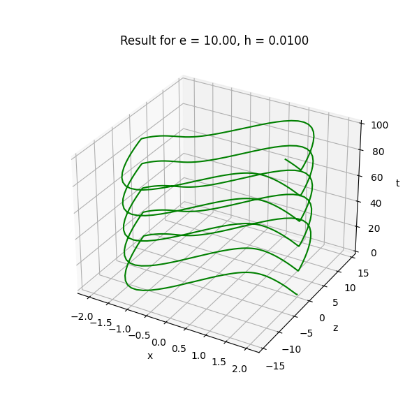
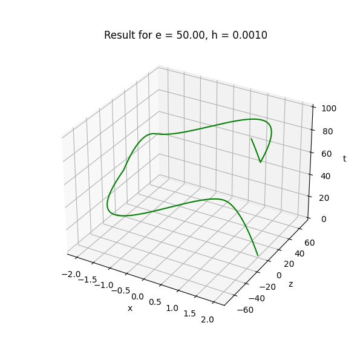
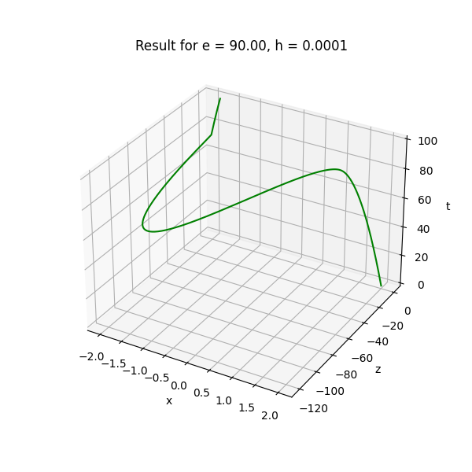

# Лабораторная работа номер 6
## VIII.11.2
Изучить поведение численного решения ОДУ второго порядка (уравнения Ван-дер-Поля):

$$ y'' + e(y^2 - 1)y' + y = 0, $$

представленного в виде системы двух ОДУ первого порядка

$$\begin{equation*} 
    \begin{cases}
        x' = z, \\
        z' = e(1 - x ^ 2)z, e > 0,
    \end{cases}
\end{equation*}$$

$$ x(0) = 2, z(0) = 0, 0 < t \leq 100 $$

в зависимости от изменения параметра $e (0,01 < e < 100)$. Использовать:
* Явный метод Рунге-Кутты $\geq 3$ порядка 
* Явный многошаговый метод Адамса $\geq 3$ порядка

### Явный метод Рунге-Кутты 4 порядка
$$ \vec{y}_{n+1} = \vec{y}_n + h \sum\limits_{i=1}^{s}{b_i \vec{k_i}} $$

$$ k_i = f(x_n + c_i h, y_n + h \sum\limits_{j=1}^{s_i}{a_{ij}f_j}),~ i = \overline{1,s},~ s_i \leq s $$

Метод определяется коэффициентами, которые обычно упорядочивают в таблицу Бутчера:

| $с_1$ | $a_{11}$ | $a_{12}$ | $a_{13}$ | $a_{14}$ |
|  ---  |    ---   |    ---   |    ---   |   ---    |
| $с_2$ | $a_{21}$ | $a_{22}$ | $a_{23}$ | $a_{24}$ |
| $с_3$ | $a_{31}$ | $a_{32}$ | $a_{33}$ | $a_{34}$ |
| $с_4$ | $a_{41}$ | $a_{42}$ | $a_{43}$ | $a_{44}$ |
|  ---  |  $b_1$   | $b_{2}$  | $b_{3}$  | $b_{4}$  |

|  $0$  |  $0$  |  $0$  |  $0$  |  $0$  |
|  ---  |  ---  |  ---  |  ---  |  ---  |
| $1/2$ | $1/2$ |  $0$  |  $0$  |  $0$  |
| $1/2$ |  $0$  | $1/2$ |  $0$  |  $0$  |
|  $1$  |  $0$  |  $0$  |  $1$  |  $0$  |
|  ---  | $1/6$ | $2/6$ | $2/6$ | $1/6$ |

Тогда получаем следующие формулы:

$$ y_{n + 1} = y_n + \frac{k_1 + 2k_2 + 2k_3 + k_4}{6}h $$

$$ k_1 = f(t_n, y_n) $$

$$ k_2 = f\left(t_n + \frac{h}{2},~ y_n + \frac{h}{2}k_1\right) $$

$$ k_3 = f\left(t_n + \frac{h}{2},~ y_n + \frac{h}{2}k_2\right) $$

$$ k_4 = f(t_n + h, y_n + hk_3) $$

Для разных $e$ и $h$ получил графики решений:

