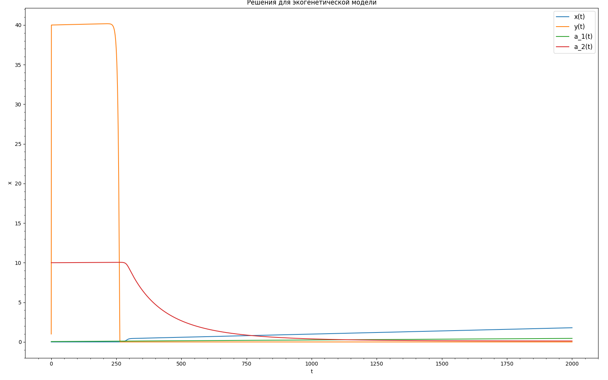

# Лабораторная работа номер 7
## X.9.13
Численность двух популяций зависит от взаимодействия между ними и двух медленно меняющихся генетических признаков.

$$\begin{equation*} 
    \begin{cases}
        \dot{x} = x(2\alpha_1 - 0.5x - \alpha_1^2 \alpha_2^{-2}y), \\
        \dot{y} = y(2\alpha_2 - \alpha_1^{-2}\alpha_2^2x - 0.5y),\\
        \dot{\alpha_1} = \varepsilon(2 - 2\alpha_1 \alpha_2^{-2}y), \\
        \dot{\alpha_2} = \varepsilon(2 - 2\alpha_1^{-2}\alpha_2x)
    \end{cases}
\end{equation*}$$

Параметры задачи таковы, что $\varepsilon \leq 0.01$, $~0 \leq x_0 \leq 40$, $~0 \leq y_0 \leq 40$, $~\alpha_{10} \ll 1$, $~\alpha_{20} = 10$, $~T_k = 2000$.

### Трехстадийный метод Розенброка 3 порядка

$$ y_{n+1} = y_n + p_1k_1 + p_2k_2 + p_3k_3 $$

$$ D_nk_1 = hf(y_n),~ D_nk_2 = hf(y_n + \beta_{21}k_1),~ D_nk_3 = f(y_n + \beta_{31}k_1 + \beta_{32}k_2) $$

$$ D_n = E + ahI $$

$E -$единичная матрица, $~I -$матрица Якоби.

Возьмем значения $\varepsilon  = 0.0001, x_0 = 0, y_0  = 1, a_{10} = 0.05,a_{20} = 10$. Итоговый результат:

    

