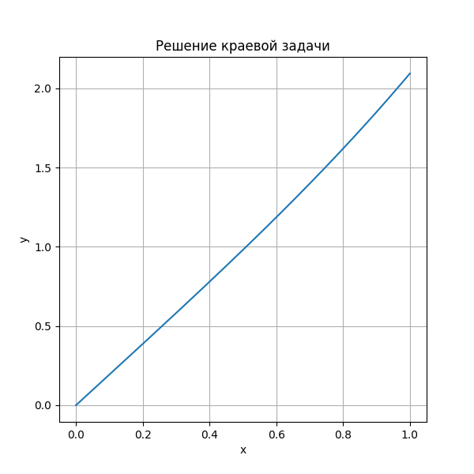

# Лабораторная работа номер 8
## XI.9.3 б)
Построить алгоритм метода пристрелки для вычисления решения следующей нелинейной задачи:

$$\begin{equation*} 
    \begin{cases}
        y'' - x \sqrt{y} = 0, 0 \leq x \leq 1\\
        y(0) = 0,~ \int\limits_{0}^{1}{y(x)dx} = 1.
    \end{cases}
\end{equation*}$$

### Решение методом стрельбы

Положим $y'(0) = 1.5$ и $y' = z$. Тогда $z(0) = 1.5$.

$$\begin{equation*} 
    \begin{cases}
        y' = z, \\
        z' = x \sqrt{y}, 0 \leq x \leq 1\\
        y(0) = 0,~ z(0) = 1.
    \end{cases}
\end{equation*}$$

Решаем это уравнение, пока не выполнится условие $\int\limits_{0}^{1}{y(x)dx} = 1$.

В итоге получилась следующая функция:

    

